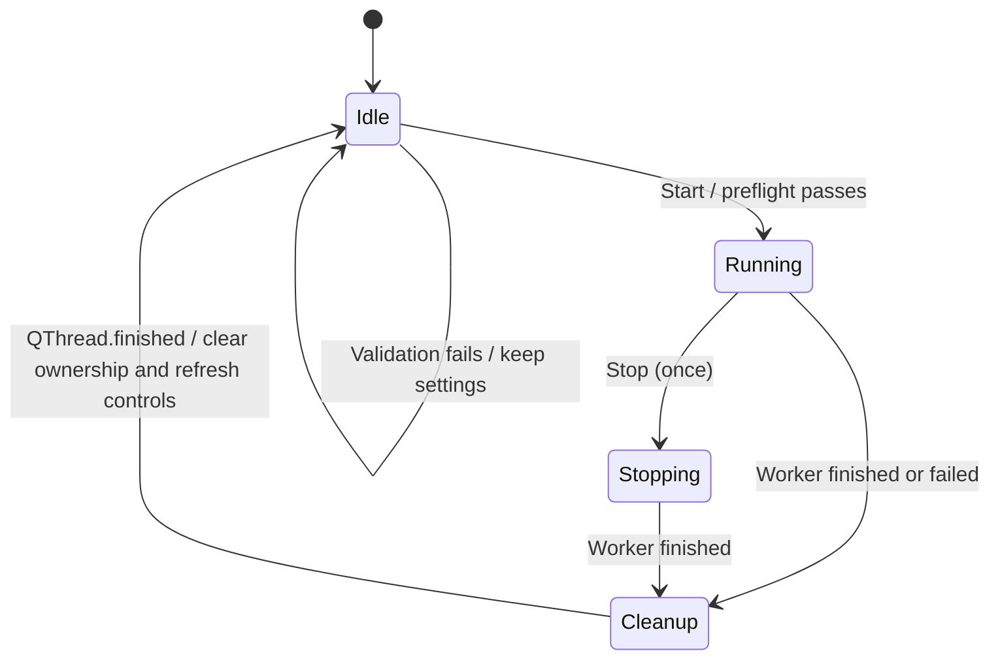

# Batch readiness and grid progress

## Fixed behavior

Previously the final worker signal disabled Stop and could enable Start while the old QThread was still finishing. Readiness now uses worker/thread ownership, and reentry is rejected in handlers even if a button is incorrectly enabled or invoked directly.

File/queue/output controls are disabled until cleanup. Preview and overlay editing retain the existing snapshot-at-start behavior. New runs keep user settings and reset progress/status/error only after preflight succeeds. Fatal run failure marks unfinished rows Failed rather than leaving them Processing.

Progress cells use a native QStyledItemDelegate with percentages and page counts, backed by numeric item data. This avoids one live widget per queued file. A full page count does not by itself change the row to Completed: the worker's completion event still owns that status.

## Verification

- Two real one-page PDF exports in succession, changing text between runs, without clearing the queue. Both produce a readable output and restore Start/settings controls after thread cleanup.
- Reentry rejection while Stop is disabled but thread ownership remains.
- Cancelled rows retain terminal state; controls unlock only after explicit cleanup.
- Progress data checks at 0%, 37% (3/8), and 100%; native painting reviewed offscreen.
- Full suite includes existing export, search, settings, and lifecycle tests; installer smoke remains skipped for this source-only change.
