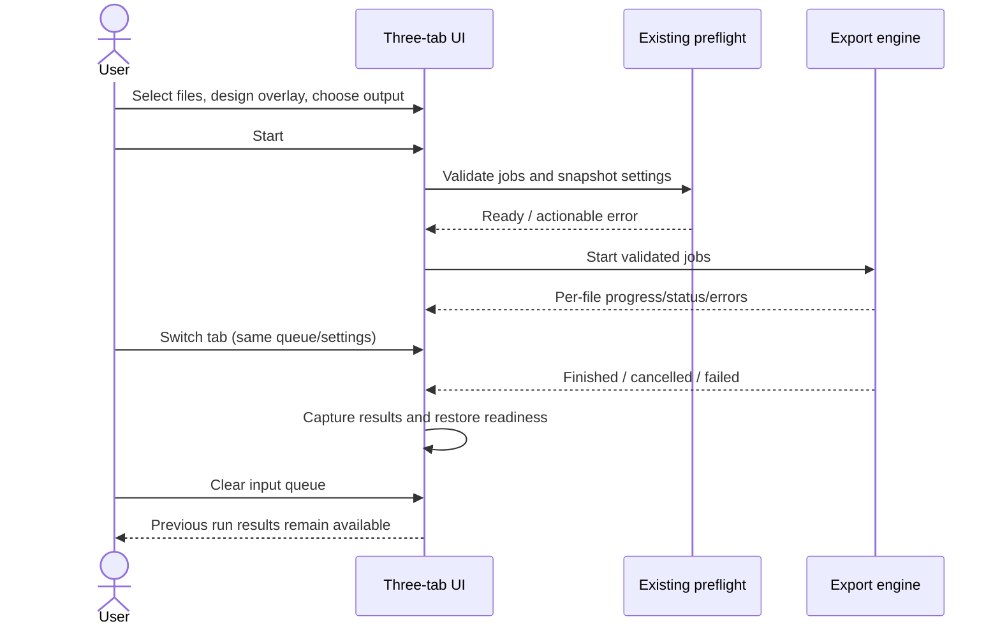

# UI redesign — 3 task tabs

User-approved direction: native OS theme, full-height preview, separate processing workspace and results. No installer in this slice.

## Delivered workflow

1. Choose files once from the main toolbar; existing deduplication and folder workflow remain available.
2. Design: resize/collapse side panels, choose a queued preview file, edit independent text/logo properties, duplicate an overlay.
3. Files and processing: settings sub-tabs on the left, resizable queue on the right. Paths occupy their own row. Queue columns retain readable widths and scroll horizontally when needed.
4. Start explicitly. Footer buttons share the existing QAction state with the toolbar; export uses specs captured at start.
5. Results: retain the latest run's output paths/status/error and elapsed time when the input queue is cleared. Retry Failed rows through the normal preflight/engine.

## Verification scope

- Automated tests cover tab navigation preserving overlay state, multi-file preview selection, independent duplication, results retention after queue clear, Failed-only retry selection, TOML layout persistence and settings overflow.
- Full existing unit/integration suite and Ruff run for this change.
- Offscreen Qt visual review at 1366×768, and 910×512 logical pixels at scale 1.5 (approximately 1366×768 physical pixels). Review loads Windows Tahoma into the offscreen renderer; application continues to use OS fonts/theme.
- Preview re-fits on viewport resize; compact layouts keep settings scrollable and file-name columns readable via horizontal scroll.
- Native Windows interactive acceptance and Linux display-server testing are not asserted by offscreen screenshots. Installer tests are intentionally skipped until a new installer is requested.

## Kanban

Done: three-tab layout; batch splitter; persistent start/stop controls; full-width path fields; results view; preview selector; layout persistence; regression tests; offscreen review.

User acceptance: try real documents, panel sizes and OS scaling on the user's display.
